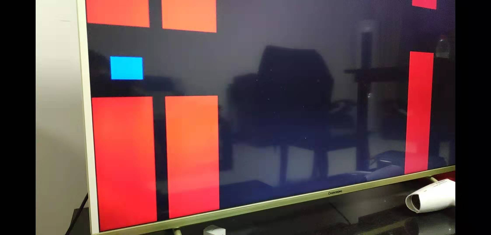
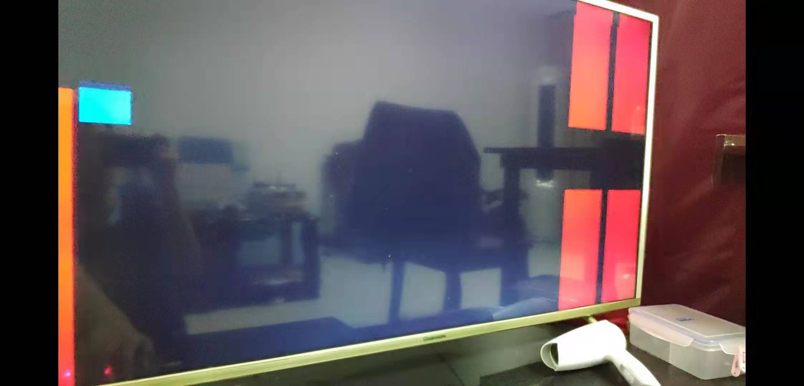

# 自选项目实验："Crappy Bird" 游戏实验报告

姓名：Meng Yit Koh
学号：517030990022

## 实验目的

1. 理解和掌握有限状态机的原理和设计方法。 
2. 掌握数字电路中时序控制的技巧。 
3. 发挥个人能力和兴趣，综合本学期所学知识，完成自选的一个题目设计。
4. 掌握 DE1-SoC VGA 使用技术。

## 本次实验所用的仪器以及软件

- DE1-SOC 实验板 
- Quartus Prime Lite 18.1.0 
- ModelSim - Intel FPGA Starter Edition 10.5b

## 实验内容

1. 完成游戏初步代码设计。
2. 利用实验提供的标准测试程序代码，完成仿真测试。 
3. 采用 I/O 统一编址方式，完成 VGA 显示功能。
4. 利用设计的 I/O 端口，通过 lw 指令，输入 DE1 实验板上的按键等输入设备信息。即将外部设备状态，读到 FPGA 上，控制游戏状态。

### 游戏流程

玩家通过连接 FPGA 至显示器。玩家可以通过点击 KEY0 对显示器上的小鸟进行活动控制。每个柱子之间都会有一个小洞，只要能穿过去就得分。祝大家好运！

### 按键功能

各按键的功能如下：

KEY[0] = 控制小鸟飞起

### 显示状态

FPGA 板子上会有分数显示。只要通过一根柱子就能得一分。VGA 屏幕上能看到游戏界面。

### 游戏效果





### 程序设计

#### 主函数

```verilog
module FlappyBird(
    // Global clock (50MHz)
	 input CLOCK_50,
	 // Button control(clr, up and down)
    input [1:0] KEY,
	 // VGA display
    output VGA_HS,
    output VGA_VS,
    output [7:0] VGA_R, VGA_G, VGA_B,
	 output [6:0] HEX2, HEX1, HEX0,
	 output VGA_BLANK_N,
	 output VGA_SYNC_N,
	 output VGA_CLK
    );
	
	wire [9:0] x;
	wire [9:0] y;
	wire clk10;
	wire [9:0] bird_y_pos;
	wire [9:0] tube1_x_pos;
	wire [9:0] tube1_y_pos;
	wire [9:0] tube2_x_pos;
	wire [9:0] tube2_y_pos;
	wire [9:0] tube3_x_pos;
	wire [9:0] tube3_y_pos;
	wire game_end;
	wire [7:0] score;
	wire bright;
	wire vgaclk;
	
	// graphics
	assign VGA_CLK=vgaclk;
	assign VGA_BLANK_N=1'b1;
	assign VGA_SYNC_N=1'b1;
	wire isdisplay;
	wire [9:0] drawX,drawY;
	
	VGA_Controller synchGen(
		.clk(vgaclk),
		.clr(KEY[1]),
		.vga_HS(VGA_HS),
		.vga_VS(VGA_VS),
		.X(drawX),
		.Y(drawY),
		.display(isdisplay)
		);
	
	VGA_Bitgen vga_bitgen(
		.clk(vgaclk),
		.bright(isdisplay),
		.x(drawX),
		.y(drawY),
		.bird_y_pos(bird_y_pos),
	   .tube1_x_pos(tube1_x_pos),
		.tube1_y_pos(tube1_y_pos),
		.tube2_x_pos(tube2_x_pos),
		.tube2_y_pos(tube2_y_pos),
		.tube3_x_pos(tube3_x_pos),
		.tube3_y_pos(tube3_y_pos),
		.game_end(game_end),
		.score(score),
		.red(VGA_R),
		.green(VGA_G),
		.blue(VGA_B)
		);
		
	VGAFrequency vga_clk(
		.clk(CLOCK_50),
		.VGAclk(vgaclk)
		);
	
	
	SignalFrequency signalfrequency(
		.clk(CLOCK_50),
		.clk10(clk10)
		);
		
	Draw_Bird draw_bird(
		.clk10(clk10),
		.clr(KEY[1]),
		.game_end(game_end),
		.up(~KEY[0]),
		.down(KEY[0]),
		.bird_y_pos(bird_y_pos)
		);
	
	Draw_Tubes draw_tubes(
		.clk10(clk10),
		.clr(KEY[1]),
		.game_end(game_end),
	   .tube1_x_pos(tube1_x_pos),
		.tube1_y_pos(tube1_y_pos),
		.tube2_x_pos(tube2_x_pos),
		.tube2_y_pos(tube2_y_pos),
		.tube3_x_pos(tube3_x_pos),
		.tube3_y_pos(tube3_y_pos),
		.score(score)
		);

	
endmodule
```

注解：连接各个模块，实现游戏的各个接口交互。完成此游戏的最顶层代码。

#### VGA 显示控制

```verilog
module VGA_Bitgen(
	 input clk,
    input bright,
    input [9:0] x,
    input [9:0] y,
	 input [9:0] bird_y_pos,
	 input [9:0] tube1_x_pos,
	 input [9:0] tube1_y_pos,
	 input [9:0] tube2_x_pos,
	 input [9:0] tube2_y_pos,
	 input [9:0] tube3_x_pos,
	 input [9:0] tube3_y_pos,
	 input game_end,
	 input [7:0] score,
    output reg [7:0] red,
	 output reg [7:0] green,
	 output reg [7:0] blue
    );
	
	// Set bird_x_pos
	wire [9:0] bird_x_pos;
	assign bird_x_pos = 10'd180;
	
	// For score display
	reg [3:0] dig_2;
	reg [3:0] dig_1;
	reg [3:0] dig_0;
	reg Dig0Seg0, Dig0Seg1, Dig0Seg2, Dig0Seg3, Dig0Seg4, Dig0Seg5, Dig0Seg6;
	reg Dig1Seg0, Dig1Seg1, Dig1Seg2, Dig1Seg3, Dig1Seg4, Dig1Seg5, Dig1Seg6;
	reg Dig2Seg0, Dig2Seg1, Dig2Seg2, Dig2Seg3, Dig2Seg4, Dig2Seg5, Dig2Seg6;
	reg digit_display_2, digit_display_1, digit_display_0;
	
	always @ (posedge clk) begin
		// Gaming!
		if (~game_end) 
		begin
			if (~bright)
			begin
			   // force black if not bright
				red = 8'b0;
				green = 8'b0;
				blue = 8'b0;
			end	
			else if ((x >= bird_x_pos - 10'd15) && (x <= bird_x_pos + 10'd15) && (y >= bird_y_pos - 10'd15) && (y <= bird_y_pos + 10'd15))
			begin
				// draw the red bird
				red = 8'b0;
				green = 8'b0;
				blue = 8'b11111111;
			end	
			else if (
				((x >= tube1_x_pos - 10'd30) && (x <= tube1_x_pos + 10'd30) && ((y >= tube1_y_pos + 10'd50) || (y <= tube1_y_pos - 10'd50))) || 
				((x >= tube2_x_pos - 10'd30) && (x <= tube2_x_pos + 10'd30) && ((y >= tube2_y_pos + 10'd50) || (y <= tube2_y_pos - 10'd50))) || 
				((x >= tube3_x_pos - 10'd30) && (x <= tube3_x_pos + 10'd30) && ((y >= tube3_y_pos + 10'd50) || (y <= tube3_y_pos - 10'd50)))
				)
				begin
				// draw the green tubes
				red = 8'b11111111;
				green = 8'b0;
				blue = 8'b0; 
				end
			else
			begin
			// background color blue
				red = 8'b0;
				green = 8'b0;
				blue = 8'b0;
				end
		end
		
		// Game ends, display score
		else begin
			// do something here, not yet implemented
		end
	end
endmodule
```

```verilog
module VGA_Controller(
	input clk,
	input clr,
	output reg vga_HS,
	output reg vga_VS,
	output reg [9:0] X,
	output reg [9:0] Y,
	output reg display
);

	// parameter is the same word as const
   // horizontal values 
	parameter H_color_scan=640;
	parameter H_front_porch=16;
	parameter H_synch_pulse=96;
	parameter H_back_porch=48;
	parameter H_scan_width=800;
	
	// verticle lines 
	parameter V_color_scan=480;
	parameter V_front_porch=10;
	parameter V_synch_pulse=2;
	parameter V_back_porch=33;
	parameter V_scan_width=525;
	
	// registers for holding the vga coordinates of the screen we're currently wring to
	reg [9:0] V_pos,H_pos;
	assign counterX=H_pos;
	assign counterY=V_pos;
	

	// generate the horizontal and verticle synch signals
	always @(posedge clk, negedge clr) begin
	 if (!clr) begin
		H_pos <= 0;
		V_pos <= 0;
		end
	 else begin
		if(H_pos < H_scan_width) begin
			H_pos <= H_pos + 1;
		end else begin // we've reached the end of a verticle scan line
			H_pos <= 0;
			
			if(V_pos < V_scan_width) begin
				V_pos <= V_pos + 1;
			end else begin
				V_pos <= 0;
			end
			
		end
		
		// generate the vs and hs signals
	
		// horizontal pulse 
		if(H_pos > H_front_porch && H_pos < (H_front_porch+H_synch_pulse)) begin
			vga_HS <= 1'b0;
		end else begin
			vga_HS <= 1'b1;
		end
		
		// verticle pulse 
		if(V_pos > V_front_porch && V_pos < (V_front_porch+V_synch_pulse)) begin
			vga_VS <= 1'b0;
		end else begin
			vga_VS <= 1'b1;
		end
		
		// set display to true when we're in the color scan region of the horizontal pulse 
		if((H_pos > (H_front_porch + H_synch_pulse + H_back_porch))) begin //&& (V_pos > (V_front_porch + V_synch_pulse + V_back_porch))) begin
				display <= 1'b1;
				X <= H_pos - (H_front_porch + H_synch_pulse + H_back_porch -1) + 144;
				Y <= V_pos - (V_front_porch + V_synch_pulse + V_back_porch -1);
			
		end else begin
				display <= 1'b0;
				X <= 0;
				Y <= 0;
		end
		end
		
	end
	
endmodule
```

注解：VGA 接口在网上及 DE1 手册上都有详细介绍。故这里不多加解释。主要是通过 frame buffer 接口一帧一帧地传给 VGA，在显示器上给显示出来。其他控制函数都只是在把柱子和小鸟给画出来。

#### 随机数生成

小鸟：

```verilog
module random_gen(
	input clk, 
	output reg [6:0] out
    );
	 
	 reg [20:0] rand;
	 initial rand = ~(20'b0);
	 reg [20:0] rand_next;
	 wire feed0;
	 wire feed1;
	 
	 assign feed0 = rand[20] ^ rand[15];
	 assign feed1 = rand[0] ^ rand [8]; 
	 
	 always @ (posedge clk)
	 begin
		rand <= rand_next;
		out = rand[6:0];
	 end
	 
	 always @ (*)
	 begin
		rand_next = {rand[18:0], feed0, feed1};
	 end

endmodule
```

注解：这是从 stack overflow 找到的一段简单代码，旨在实现随机数生成。我们其实可以用 Quartus MegaWizard 提供的 #random 函数生成随机数但是这里不选择的原因是因为此方法会造成随机数过于随机，过高提高游戏难度。我的运行实验结果是我们根本无法玩此游戏因为两根相邻柱子的洞口一高一低，相差太远，导致小鸟无法穿越洞口。这种设计非常不合理。

#### 柱子及小鸟图案生成

```verilog
module Draw_Bird(
    input clk10,
    input clr,
	 input game_end,
    input up,
	 input down,
    output reg [9:0] bird_y_pos
    );
	
	 initial bird_y_pos = 10'd70;
	 
	 always @ (posedge clk10, negedge clr) 
	 begin
		if (!clr)
			bird_y_pos <= 10'd70;
		else if (~game_end) 
		 begin
			if ((up == 1) && (bird_y_pos >= 10'd15))
				bird_y_pos <= bird_y_pos - 10'd6;
			if ((down == 1) && (bird_y_pos <= 10'd465))
				bird_y_pos <= bird_y_pos + 10'd6;
			else if (bird_y_pos >=10'd466)
				bird_y_pos <= 10'd465;
			else if (bird_y_pos <=10'd14)
				bird_y_pos <= 10'd15;
		end
	 end
		
endmodule
```

柱子：

```verilog
module Draw_Tubes(
	input clk10,
	input clr,
	input game_end,
	output reg [9:0] tube1_y_pos,
	output reg [9:0] tube2_y_pos,
	output reg [9:0] tube3_y_pos,
	output reg [9:0] tube1_x_pos,
	output reg [9:0] tube2_x_pos,
	output reg [9:0] tube3_x_pos,
	output reg [7:0] score
    );
	
	
	initial score = 8'b0;
	initial tube1_x_pos = 10'd364;
	initial tube2_x_pos = 10'd584;
	initial tube3_x_pos = 10'd804;
	initial tube1_y_pos = 10'd240;
	initial tube2_y_pos = 10'd220;
	initial tube3_y_pos = 10'd150;
	
	wire [6:0] rand;
	reg [9:0] randconv;
	
	random_gen pipe_gen(
		.clk(clk10),
		.out(rand)
	);
	
	always @ (posedge clk10, negedge clr) begin
		if (!clr) begin
			score <= 8'b0;
			tube1_x_pos <= 10'd324;
			tube2_x_pos <= 10'd400;
			tube3_x_pos <= 10'd804;
			tube1_y_pos <= 10'd240;
			tube2_y_pos <= 10'd240;
			tube3_y_pos <= 10'd150;
		end
		else if (~game_end) begin
			// converted rand to randconv, lowing game difficulty
			randconv <= rand;
			tube1_x_pos <= tube1_x_pos - 10'd3;
			tube2_x_pos <= tube2_x_pos - 10'd3;
			tube3_x_pos <= tube3_x_pos - 10'd3;
			// scoring algorithm should be done here, not implemented
		end
	end

endmodule
```

注解：实现了柱子和小鸟的图形及颜色。

## 实验总结

实验代码经过编译综合，载入到开发板后，能正常完成预期的游戏功能。I/O 处理良好，未出现奇怪显示状况。

感谢上海交通大学软件学院开设这门课，让我学习如何使用 FPGA 实现一款游戏。感谢王老师的教导。感谢热心的助教。

在本次实验中，我综合本学期所学知识，发挥个人能力和兴趣，实现了一个基于 Verilog 和 FPGA 的数字游戏，在实际操作中更清晰地理解了有限状态机的设计以及硬件的时序控制问题，并联系 CPU 设计的知识进行了进一步的思考，为本课程的实验设计画上了一个圆满的句号。
